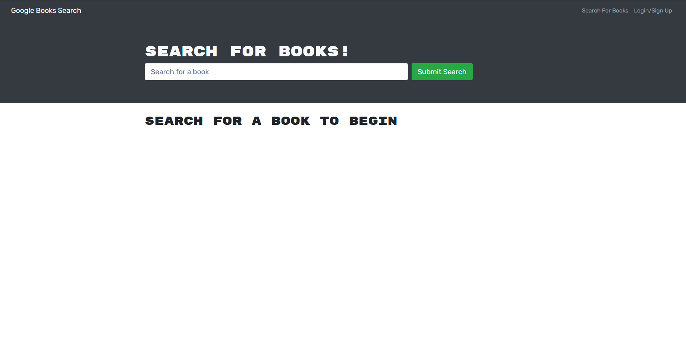
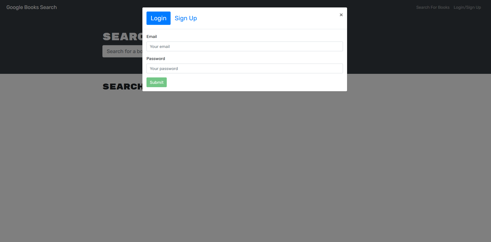
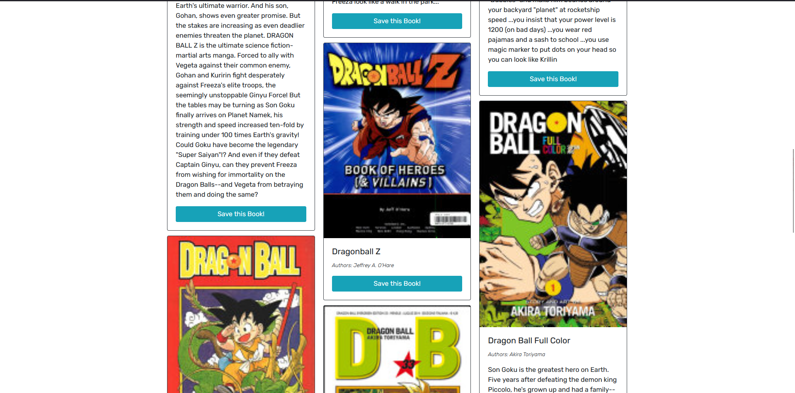
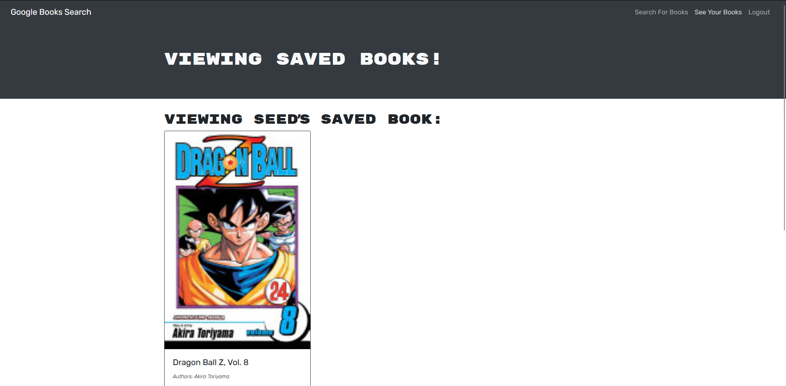

# Book Search Engine


## Description

Utilizing the google books API, search for any available book and save it to your own list to have books you would like to read in the future!
This MERN stack application allows user to search for any book utilizing the google books api. If the user is logged in, they will be able to save books into their list or also delete books from their list.

## Table of Contents

1. [Installation](#installation)
2. [Usage](#usage)
3. [Questions](#questions)
4. [License](#license)

## Installation

In order to use this application after cloning it down, you would need to run the following code block,

```
npm i
```

By doing so, you will be able to install all the npm packages you will need in the root, server, and client directories.

With this you are ready to run this application on your local host via the code block below.

```
npm run build
npm run develop
```

## Usage

Please see the images below that shows the webpage in action!

### Homepage



### Log in



### Search



### Book List



## Questions

If you have any questions, please feel free to reach out to me via:

1. Email: dhong0925@gmail.com
2. GitHub: Lunirs

## License

Licensed under the MIT license.

## Credits

Copyright © Daniel Hong All rights reserved.
